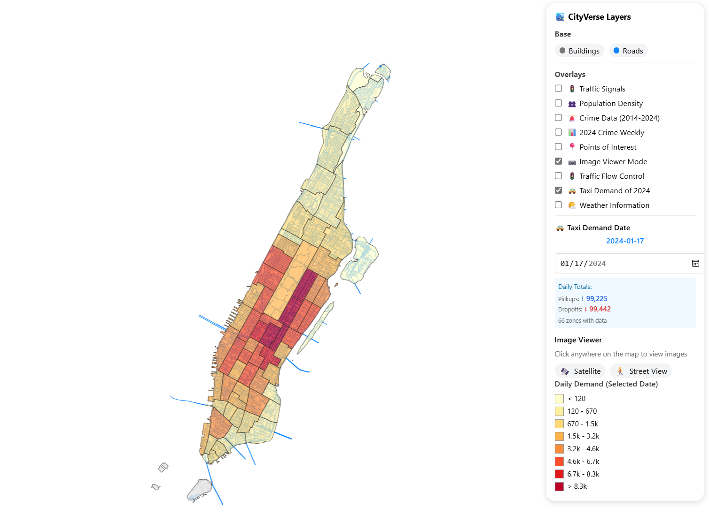

# CityVerse 

This repo is for CityVerse: A Unified Data Framework for Large Language Models in Urban Computing

## 📘 Introduction

Large Language Models (LLMs) show remarkable potential for urban computing, from spatial reasoning to predictive analytics. However, evaluating LLMs across diverse urban tasks faces two critical challenges: lack of unified platforms for consistent multi-source data access, and fragmented task definitions that hinder fair comparison. To address these challenges, we present CityVerse, the first unified platform integrating multi-source urban data, capability-based task taxonomy, and dynamic simulation for systematic LLM evaluation in urban contexts. CityVerse provides: (1) coordinate-based Data APIs unifying ten categories of urban data—including spatial features, temporal dynamics, demographics, and multi-modal imagery-with over 38 million curated records; (2) Task APIs organizing 43 urban computing tasks into a four-level cognitive hierarchy: Perception, Spatial Understanding, Reasoning \& Prediction, and Decision \& Interaction, enabling standardized evaluation across capability levels; (3) an interactive visualization frontend supporting real-time data retrieval, multi-layer display, and simulation replay for intuitive exploration and validation. We validate the platform's effectiveness through evaluations on mainstream LLMs across representative tasks, demonstrating its capability to support reproducible and systematic assessment. CityVerse provides a reusable foundation for advancing LLMs and multi-task approaches in the urban computing domain.

*The code for our project is currently being prepared, and we plan to make it publicly available as soon as possible. The repository currently contains only the New York City demo. Feel free to try it by following the instructions below.*

## 🚀 Deployment & Usage

### 1. Start the Tile Server

Make sure **Docker** is running.

```bash
cd CityPack_NY_v0
docker run --rm -it -p 8080:8080 \
  -v "$(pwd)/web/tiles:/data" \
  maptiler/tileserver-gl -p 8080 -c /data/config.json
```

### 2. Start the Frontend Server

```bash
cd web
python -m http.server 8000
```

Access the frontend at: http://localhost:8000/

Use the panel on the right to toggle data layers and visualize them on the map.





------

## 🎬 Simulation Replay

To run a trajectory & traffic signal replay:

1. Visit **http://localhost:8000/**
2. Enable the layer **“🚦 Traffic Flow Control”**
3. Wait for the road network to finish loading
4. Upload a replay file (`replay.txt`)
    Example: `sim/CityFlow/examples/replay_manhattan/log.txt`
5. Use the replay panel or keyboard shortcuts to control playback


------

## 🖼️ Image Viewer Mode

The image viewer supports displaying **satellite images** and **street-level photos** at any clicked point on the map.

##### Supported Sources

- **Satellite imagery**: ESRI World Imagery (no configuration required)
- **Street-level imagery**: Mapillary API (requires token)

### 1. Mapillary API Setup:

1. Register a developer account
    https://www.mapillary.com/developer
2. Create an app and obtain your **access token**
3. Open `satellite_streetview_api.py` and update:

```python
# Line 25
self.mapillary_token = "YOUR_MAPILLARY_ACCESS_TOKEN_HERE Start with 'MLY|' "
```

------

### 2. Start the Image Service

```bash
python simple_image_server.py 8081
```

After launching the server:

1. Enable **Image Viewer Mode** in the frontend
2. Click on any point on the map
3. Satellite and street-view images for that location will be displayed


# 🙏 Acknowledgements

CityVerse is based on many open-source projects, including [Urbench](https://github.com/opendatalab/UrBench), [Cityflow](https://github.com/cityflow-project/CityFlow), [CityBench](https://github.com/tsinghua-fib-lab/CityBench) and [CityGPT](https://github.com/tsinghua-fib-lab/CityGPT). We would like to thank the authors for their contributions to the communities.